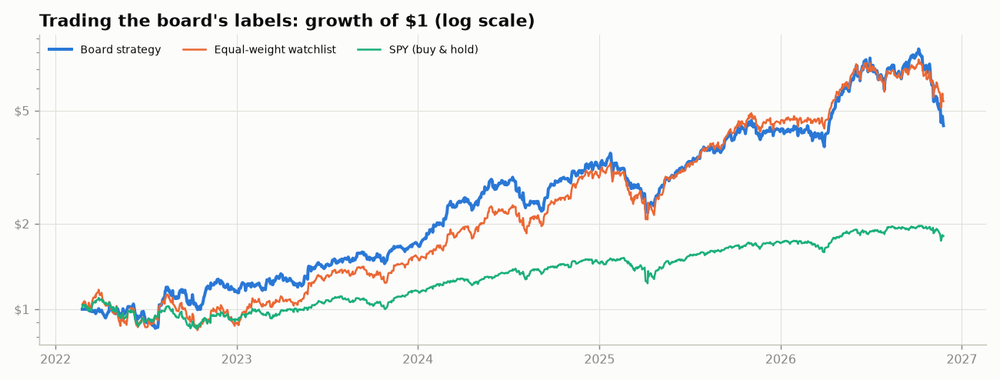
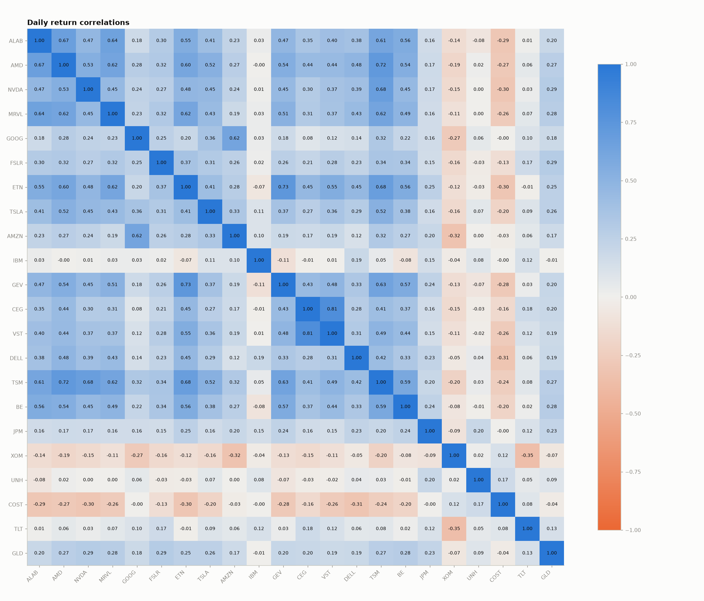

# stocklab report
Generated 2026-11-19 | data source: `yahoo` | history: 5 years | watchlist: ALAB, AMD, NVDA, MRVL, GOOG, FSLR, SKHY, ETN, TSLA, SPCX, AMZN, IBM, GEV, CEG, VST, DELL, TSM, BE

> Educational research code, not investment advice. Past results do not predict future returns.

## 1. Decision board

Data as of the 2026-11-18 close. `*` = provisional (under 200 trading days of history).

| ticker | action | close | 1 day | 1 month | buy rank | sell warnings | pullback entry | breakout | stop | why |
|---|---|---|---|---|---|---|---|---|---|---|
| AMD | BUY | 530.14 | +5.3% | -0.9% | 2/18 | 2/15 | 514.64 | 586.47 | 433.98 | buy rank 2/18; +24% vs 200-day average; below 50-day, volatility spike |
| AMZN | BUY | 267.74 | +3.8% | +1.9% | 4/18 | 1/15 | 257.13 | 271.41 | 239.09 | buy rank 4/18; +9% vs 200-day average; distribution days |
| TSLA | WATCH | 383.72 | +0.9% | +2.7% | 9/18 | 5/15 | 375.81 | 408.27 | 344.54 | +0% vs 200-day average; death cross, MACD bearish, distribution days, 20%+ off high |
| SPCX | REDUCE* | 143.50 | +1.3% | -2.9% | 6/18 | 5/10 |  |  |  | -3% vs 50-day average; below 50-day, distribution days, 20%+ off high, below chandelier stop (provisional: 111 days of history) |
| ALAB | REDUCE | 216.75 | +2.4% | -23.9% | 13/18 | 7/15 |  |  |  | -16% vs 200-day average; below 50-day, below 200-day, distribution days, 20%+ off high, below chandelier stop |
| CEG | REDUCE | 262.74 | -2.0% | +1.7% | 14/18 | 7/15 |  |  |  | -5% vs 200-day average; below 50-day, below 200-day, death cross, distribution days, 20%+ off high |
| BE | REDUCE | 170.98 | -1.4% | -23.2% | 15/18 | 8/15 |  |  |  | -24% vs 200-day average; below 50-day, below 200-day, MACD bearish, distribution days, 20%+ off high, below chandelier stop |
| DELL | SELL | 313.11 | -3.0% | -32.2% | 1/18 | 9/15 |  |  |  | -9% vs 200-day average; below 50-day, below 200-day, MACD bearish, distribution days, 20%+ off high, volatility spike, below chandelier stop |
| MRVL | SELL | 145.54 | -2.2% | -39.5% | 3/18 | 9/15 |  |  |  | -23% vs 200-day average; below 50-day, below 200-day, MACD bearish, distribution days, 20%+ off high, volatility spike, below chandelier stop |
| TSM | SELL | 362.62 | +0.8% | -14.7% | 5/18 | 9/15 |  |  |  | -10% vs 200-day average; below 50-day, below 200-day, MACD bearish, distribution days, 20%+ off high, volatility spike, below chandelier stop |
| IBM | SELL | 228.53 | -1.1% | -4.9% | 7/18 | 9/15 |  |  |  | -6% vs 200-day average; below 50-day, below 200-day, death cross, MACD bearish, 20%+ off high, below chandelier stop |
| ETN | SELL | 338.34 | +0.4% | -11.2% | 8/18 | 9/15 |  |  |  | -14% vs 200-day average; below 50-day, below 200-day, MACD bearish, distribution days, 20%+ off high, volatility spike, below chandelier stop |
| GOOG | SELL | 279.20 | +0.6% | -17.0% | 10/18 | 10/15 |  |  |  | -17% vs 200-day average; below 50-day, below 200-day, death cross, distribution days, 20%+ off high, volatility spike, below chandelier stop |
| GEV | SELL | 772.22 | -1.0% | -13.2% | 11/18 | 11/15 |  |  |  | -19% vs 200-day average; below 50-day, below 200-day, death cross, MACD bearish, distribution days, 20%+ off high, volatility spike, below chandelier stop |
| NVDA | SELL | 150.96 | -2.9% | -30.3% | 12/18 | 10/15 |  |  |  | -26% vs 200-day average; below 50-day, below 200-day, MACD bearish, distribution days, high-volume breakdown, 20%+ off high, below chandelier stop |
| VST | SELL | 125.58 | -1.2% | -16.5% | 16/18 | 11/15 |  |  |  | -17% vs 200-day average; below 50-day, below 200-day, death cross, MACD bearish, distribution days, 20%+ off high, volatility spike, below chandelier stop |
| SKHY | SELL* | 122.47 | -0.1% | -12.4% | 17/18 | 6/10 |  |  |  | -24% vs 50-day average; below 50-day, MACD bearish, distribution days, 20%+ off high, below chandelier stop (provisional: 93 days of history) |
| FSLR | SELL | 150.98 | -1.3% | -13.4% | 18/18 | 10/15 |  |  |  | -29% vs 200-day average; below 50-day, below 200-day, death cross, MACD bearish, distribution days, 20%+ off high, below chandelier stop |


**Trading the labels** (2022-02-15 to 2026-11-18): buy on BUY, exit on SELL, REDUCE or AVOID, reviewed weekly with next-day execution and 5 bp costs.

| strategy | CAGR | Volatility | Sharpe | Max drawdown | Time invested | Avg holdings |
|---|---|---|---|---|---|---|
| Board strategy | +37.9% | 33.7% | 1.12 | -39.1% | 98% | 6.4 |
| Equal-weight watchlist | +42.1% | 34.2% | 1.20 | -36.8% | 100% | 15.1 |
| SPY (buy & hold) | +12.4% | 17.3% | 0.76 | -22.1% |  |  |

Sharpe difference vs equal weight: -0.08, 95% block-bootstrap CI [-0.56, +0.36].

Forward 21-day return after each label, relative to the watchlist average on the same date (sampled every 21 days, t-test across dates):

| label | observations | dates | mean 21d excess return | hit rate | p_value |
|---|---|---|---|---|---|
| BUY | 234 | 54 | +1.1% | 59% | 0.25 |
| HOLD | 115 | 42 | +1.6% | 55% | 0.33 |
| WATCH | 182 | 51 | +0.1% | 45% | 0.92 |
| AVOID | 49 | 23 | +0.8% | 48% | 0.74 |
| REDUCE | 174 | 53 | -0.1% | 42% | 0.96 |
| SELL | 84 | 36 | -2.7% | 47% | 0.11 |



## 2. Sell check, stock by stock

```
ALAB  REDUCE  (score 7/15, close 216.75 on 2026-11-18)
  RSI 41 | -55.1% from 52-week high
  Triggered:
    - [trend] Close below the 50-day moving average (+1)
    - [trend] Close below the 200-day moving average (+2)
    - [volume] 5+ distribution days in the last 25 sessions (institutional selling) (+1)
    - [risk] 20%+ below the 52-week high (+1)
    - [risk] Close below the chandelier stop (22-day high minus 3x ATR) (+2)
  Levels to watch:
    50-day SMA                 288.88  (price is below, -25.0%)
    200-day SMA                258.31  (price is below, -16.1%)
    Chandelier stop            232.09  (price is below, -6.6%)
```

```
AMD  HOLD  (score 2/15, close 530.14 on 2026-11-18)
  RSI 50 | -18.4% from 52-week high
  Triggered:
    - [trend] Close below the 50-day moving average (+1)
    - [risk] 21-day volatility 1.5x+ its 1-year median (+1)
  Levels to watch:
    50-day SMA                 555.22  (price is below, -4.5%)
    Chandelier stop            473.01  (price is above, +12.1%)
    200-day SMA                427.18  (price is above, +24.1%)
```

```
NVDA  EXIT  (score 10/15, close 150.96 on 2026-11-18)
  RSI 21 | -36.9% from 52-week high
  Triggered:
    - [trend] Close below the 50-day moving average (+1)
    - [trend] Close below the 200-day moving average (+2)
    - [momentum] MACD line below its signal line (+1)
    - [volume] 5+ distribution days in the last 25 sessions (institutional selling) (+1)
    - [volume] Down day closing below the 50-day average on 1.5x+ average volume (+2)
    - [risk] 20%+ below the 52-week high (+1)
    - [risk] Close below the chandelier stop (22-day high minus 3x ATR) (+2)
  Levels to watch:
    50-day SMA                 210.30  (price is below, -28.2%)
    200-day SMA                203.45  (price is below, -25.8%)
    Chandelier stop            193.15  (price is below, -21.8%)
```

```
MRVL  EXIT  (score 9/15, close 145.54 on 2026-11-18)
  RSI 33 | -54.0% from 52-week high
  Triggered:
    - [trend] Close below the 50-day moving average (+1)
    - [trend] Close below the 200-day moving average (+2)
    - [momentum] MACD line below its signal line (+1)
    - [volume] 5+ distribution days in the last 25 sessions (institutional selling) (+1)
    - [risk] 20%+ below the 52-week high (+1)
    - [risk] 21-day volatility 1.5x+ its 1-year median (+1)
    - [risk] Close below the chandelier stop (22-day high minus 3x ATR) (+2)
  Levels to watch:
    50-day SMA                 224.30  (price is below, -35.1%)
    Chandelier stop            205.97  (price is below, -29.3%)
    200-day SMA                187.97  (price is below, -22.6%)
```

```
GOOG  EXIT  (score 10/15, close 279.20 on 2026-11-18)
  RSI 33 | -29.9% from 52-week high
  Triggered:
    - [trend] Close below the 50-day moving average (+1)
    - [trend] Close below the 200-day moving average (+2)
    - [trend] 50-day average below the 200-day average (+2)
    - [volume] 5+ distribution days in the last 25 sessions (institutional selling) (+1)
    - [risk] 20%+ below the 52-week high (+1)
    - [risk] 21-day volatility 1.5x+ its 1-year median (+1)
    - [risk] Close below the chandelier stop (22-day high minus 3x ATR) (+2)
  Levels to watch:
    200-day SMA                335.21  (price is below, -16.7%)
    50-day SMA                 321.89  (price is below, -13.3%)
    Chandelier stop            312.16  (price is below, -10.6%)
```

```
FSLR  EXIT  (score 10/15, close 150.98 on 2026-11-18)
  RSI 30 | -52.6% from 52-week high
  Triggered:
    - [trend] Close below the 50-day moving average (+1)
    - [trend] Close below the 200-day moving average (+2)
    - [trend] 50-day average below the 200-day average (+2)
    - [momentum] MACD line below its signal line (+1)
    - [volume] 5+ distribution days in the last 25 sessions (institutional selling) (+1)
    - [risk] 20%+ below the 52-week high (+1)
    - [risk] Close below the chandelier stop (22-day high minus 3x ATR) (+2)
  Levels to watch:
    200-day SMA                212.01  (price is below, -28.8%)
    Chandelier stop            185.36  (price is below, -18.5%)
    50-day SMA                 181.47  (price is below, -16.8%)
```

```
SKHY  EXIT  (score 6/10, close 122.47 on 2026-11-18)
  RSI 38 | -38.3% from high since listing
  Only 93 trading days of history; not scored yet: below_sma200, death_cross, volatility_spike
  Triggered:
    - [trend] Close below the 50-day moving average (+1)
    - [momentum] MACD line below its signal line (+1)
    - [volume] 5+ distribution days in the last 25 sessions (institutional selling) (+1)
    - [risk] 20%+ below the high since listing (+1)
    - [risk] Close below the chandelier stop (22-day high minus 3x ATR) (+2)
  Levels to watch:
    50-day SMA                 160.13  (price is below, -23.5%)
    Chandelier stop            137.28  (price is below, -10.8%)
```

```
ETN  EXIT  (score 9/15, close 338.34 on 2026-11-18)
  RSI 38 | -26.2% from 52-week high
  Triggered:
    - [trend] Close below the 50-day moving average (+1)
    - [trend] Close below the 200-day moving average (+2)
    - [momentum] MACD line below its signal line (+1)
    - [volume] 5+ distribution days in the last 25 sessions (institutional selling) (+1)
    - [risk] 20%+ below the 52-week high (+1)
    - [risk] 21-day volatility 1.5x+ its 1-year median (+1)
    - [risk] Close below the chandelier stop (22-day high minus 3x ATR) (+2)
  Levels to watch:
    50-day SMA                 395.55  (price is below, -14.5%)
    200-day SMA                395.23  (price is below, -14.4%)
    Chandelier stop            345.66  (price is below, -2.1%)
```

```
TSLA  WATCH  (score 5/15, close 383.72 on 2026-11-18)
  RSI 51 | -21.7% from 52-week high
  Triggered:
    - [trend] 50-day average below the 200-day average (+2)
    - [momentum] MACD line below its signal line (+1)
    - [volume] 5+ distribution days in the last 25 sessions (institutional selling) (+1)
    - [risk] 20%+ below the 52-week high (+1)
  Levels to watch:
    200-day SMA                382.08  (price is above, +0.4%)
    50-day SMA                 375.81  (price is above, +2.1%)
    Chandelier stop            367.33  (price is above, +4.5%)
```

```
SPCX  REDUCE  (score 5/10, close 143.50 on 2026-11-18)
  RSI 51 | -32.1% from high since listing
  Only 111 trading days of history; not scored yet: below_sma200, death_cross, volatility_spike
  Triggered:
    - [trend] Close below the 50-day moving average (+1)
    - [volume] 5+ distribution days in the last 25 sessions (institutional selling) (+1)
    - [risk] 20%+ below the high since listing (+1)
    - [risk] Close below the chandelier stop (22-day high minus 3x ATR) (+2)
  Levels to watch:
    50-day SMA                 148.38  (price is below, -3.3%)
    Chandelier stop            143.82  (price is below, -0.2%)
```

```
AMZN  HOLD  (score 1/15, close 267.74 on 2026-11-18)
  RSI 57 | -5.7% from 52-week high
  Triggered:
    - [volume] 5+ distribution days in the last 25 sessions (institutional selling) (+1)
  Levels to watch:
    50-day SMA                 255.12  (price is above, +4.9%)
    Chandelier stop            248.28  (price is above, +7.8%)
    200-day SMA                244.91  (price is above, +9.3%)
```

```
IBM  EXIT  (score 9/15, close 228.53 on 2026-11-18)
  RSI 37 | -29.6% from 52-week high
  Triggered:
    - [trend] Close below the 50-day moving average (+1)
    - [trend] Close below the 200-day moving average (+2)
    - [trend] 50-day average below the 200-day average (+2)
    - [momentum] MACD line below its signal line (+1)
    - [risk] 20%+ below the 52-week high (+1)
    - [risk] Close below the chandelier stop (22-day high minus 3x ATR) (+2)
  Levels to watch:
    200-day SMA                242.25  (price is below, -5.7%)
    Chandelier stop            238.24  (price is below, -4.1%)
    50-day SMA                 236.52  (price is below, -3.4%)
```

```
GEV  EXIT  (score 11/15, close 772.22 on 2026-11-18)
  RSI 39 | -34.2% from 52-week high
  Triggered:
    - [trend] Close below the 50-day moving average (+1)
    - [trend] Close below the 200-day moving average (+2)
    - [trend] 50-day average below the 200-day average (+2)
    - [momentum] MACD line below its signal line (+1)
    - [volume] 5+ distribution days in the last 25 sessions (institutional selling) (+1)
    - [risk] 20%+ below the 52-week high (+1)
    - [risk] 21-day volatility 1.5x+ its 1-year median (+1)
    - [risk] Close below the chandelier stop (22-day high minus 3x ATR) (+2)
  Levels to watch:
    200-day SMA                951.26  (price is below, -18.8%)
    50-day SMA                 901.85  (price is below, -14.4%)
    Chandelier stop            773.63  (price is below, -0.2%)
```

```
CEG  REDUCE  (score 7/15, close 262.74 on 2026-11-18)
  RSI 48 | -30.2% from 52-week high
  Triggered:
    - [trend] Close below the 50-day moving average (+1)
    - [trend] Close below the 200-day moving average (+2)
    - [trend] 50-day average below the 200-day average (+2)
    - [volume] 5+ distribution days in the last 25 sessions (institutional selling) (+1)
    - [risk] 20%+ below the 52-week high (+1)
  Levels to watch:
    200-day SMA                277.43  (price is below, -5.3%)
    50-day SMA                 267.46  (price is below, -1.8%)
    Chandelier stop            246.70  (price is above, +6.5%)
```

```
VST  EXIT  (score 11/15, close 125.58 on 2026-11-18)
  RSI 41 | -30.0% from 52-week high
  Triggered:
    - [trend] Close below the 50-day moving average (+1)
    - [trend] Close below the 200-day moving average (+2)
    - [trend] 50-day average below the 200-day average (+2)
    - [momentum] MACD line below its signal line (+1)
    - [volume] 5+ distribution days in the last 25 sessions (institutional selling) (+1)
    - [risk] 20%+ below the 52-week high (+1)
    - [risk] 21-day volatility 1.5x+ its 1-year median (+1)
    - [risk] Close below the chandelier stop (22-day high minus 3x ATR) (+2)
  Levels to watch:
    200-day SMA                151.17  (price is below, -16.9%)
    50-day SMA                 141.80  (price is below, -11.4%)
    Chandelier stop            136.58  (price is below, -8.1%)
```

```
DELL  EXIT  (score 9/15, close 313.11 on 2026-11-18)
  RSI 33 | -46.7% from 52-week high
  Triggered:
    - [trend] Close below the 50-day moving average (+1)
    - [trend] Close below the 200-day moving average (+2)
    - [momentum] MACD line below its signal line (+1)
    - [volume] 5+ distribution days in the last 25 sessions (institutional selling) (+1)
    - [risk] 20%+ below the 52-week high (+1)
    - [risk] 21-day volatility 1.5x+ its 1-year median (+1)
    - [risk] Close below the chandelier stop (22-day high minus 3x ATR) (+2)
  Levels to watch:
    50-day SMA                 480.34  (price is below, -34.8%)
    Chandelier stop            407.46  (price is below, -23.2%)
    200-day SMA                345.65  (price is below, -9.4%)
```

```
TSM  EXIT  (score 9/15, close 362.62 on 2026-11-18)
  RSI 37 | -25.4% from 52-week high
  Triggered:
    - [trend] Close below the 50-day moving average (+1)
    - [trend] Close below the 200-day moving average (+2)
    - [momentum] MACD line below its signal line (+1)
    - [volume] 5+ distribution days in the last 25 sessions (institutional selling) (+1)
    - [risk] 20%+ below the 52-week high (+1)
    - [risk] 21-day volatility 1.5x+ its 1-year median (+1)
    - [risk] Close below the chandelier stop (22-day high minus 3x ATR) (+2)
  Levels to watch:
    50-day SMA                 425.87  (price is below, -14.9%)
    200-day SMA                402.15  (price is below, -9.8%)
    Chandelier stop            388.38  (price is below, -6.6%)
```

```
BE  REDUCE  (score 8/15, close 170.98 on 2026-11-18)
  RSI 39 | -50.6% from 52-week high
  Triggered:
    - [trend] Close below the 50-day moving average (+1)
    - [trend] Close below the 200-day moving average (+2)
    - [momentum] MACD line below its signal line (+1)
    - [volume] 5+ distribution days in the last 25 sessions (institutional selling) (+1)
    - [risk] 20%+ below the 52-week high (+1)
    - [risk] Close below the chandelier stop (22-day high minus 3x ATR) (+2)
  Levels to watch:
    50-day SMA                 238.50  (price is below, -28.3%)
    200-day SMA                223.76  (price is below, -23.6%)
    Chandelier stop            179.49  (price is below, -4.7%)
```

## 3. Which sell signals actually work? (event study)

Panel: 46 stocks, 5 years. Null hypothesis: returns after a signal look like returns on random days from the same stocks.

| rule | horizon | events | mean_after_signal | mean_random_days | difference | p_value | q_value | drop10_after_signal | drop10_base_rate | verdict |
|---|---|---|---|---|---|---|---|---|---|---|
| below_sma50 | 5d | 1076 | +0.28% | +0.68% | -0.40% | 0.015 | 0.136 | 40% | 36% | weak (not significant) |
| below_sma50 | 21d | 1059 | +2.22% | +3.07% | -0.85% | 0.012 | 0.136 | 40% | 36% | weak (not significant) |
| below_sma50 | 63d | 1002 | +8.52% | +10.14% | -1.63% | 0.016 | 0.136 | 40% | 36% | weak (not significant) |
| below_sma200 | 5d | 522 | +0.53% | +0.62% | -0.09% | 0.365 | 0.817 | 39% | 36% | weak (not significant) |
| below_sma200 | 21d | 505 | +1.42% | +2.76% | -1.34% | 0.009 | 0.136 | 39% | 36% | weak (not significant) |
| below_sma200 | 63d | 476 | +9.21% | +9.05% | +0.16% | 0.554 | 1.000 | 39% | 36% | no edge |
| death_cross | 5d | 156 | +0.50% | +0.66% | -0.16% | 0.371 | 0.817 | 44% | 36% | weak (not significant) |
| death_cross | 21d | 148 | +2.24% | +2.90% | -0.66% | 0.277 | 0.817 | 44% | 36% | weak (not significant) |
| death_cross | 63d | 142 | +13.92% | +9.68% | +4.23% | 0.964 | 1.000 | 44% | 36% | no edge |
| rsi_divergence | 5d | 503 | +0.43% | +0.76% | -0.32% | 0.115 | 0.620 | 37% | 36% | weak (not significant) |
| rsi_divergence | 21d | 494 | +3.26% | +3.50% | -0.25% | 0.341 | 0.817 | 37% | 36% | weak (not significant) |
| rsi_divergence | 63d | 486 | +10.97% | +11.73% | -0.76% | 0.253 | 0.817 | 37% | 36% | weak (not significant) |
| rsi_rollover | 5d | 645 | +1.83% | +0.74% | +1.09% | 1.000 | 1.000 | 33% | 36% | no edge |
| rsi_rollover | 21d | 634 | +3.70% | +3.42% | +0.28% | 0.704 | 1.000 | 33% | 36% | no edge |
| rsi_rollover | 63d | 621 | +10.41% | +11.57% | -1.15% | 0.131 | 0.620 | 33% | 36% | weak (not significant) |
| macd_bearish | 5d | 1620 | +0.87% | +0.70% | +0.17% | 0.865 | 1.000 | 36% | 36% | no edge |
| macd_bearish | 21d | 1604 | +3.34% | +3.23% | +0.11% | 0.635 | 1.000 | 36% | 36% | no edge |
| macd_bearish | 63d | 1527 | +11.29% | +10.71% | +0.57% | 0.807 | 1.000 | 36% | 36% | no edge |
| distribution_cluster | 5d | 1079 | +0.90% | +0.71% | +0.19% | 0.842 | 1.000 | 35% | 36% | no edge |
| distribution_cluster | 21d | 1065 | +2.88% | +3.24% | -0.36% | 0.191 | 0.787 | 35% | 36% | weak (not significant) |
| distribution_cluster | 63d | 1022 | +10.50% | +10.89% | -0.39% | 0.313 | 0.817 | 35% | 36% | weak (not significant) |
| high_volume_breakdown | 5d | 766 | +0.82% | +0.67% | +0.15% | 0.736 | 1.000 | 34% | 36% | no edge |
| high_volume_breakdown | 21d | 734 | +3.64% | +3.03% | +0.61% | 0.888 | 1.000 | 34% | 36% | no edge |
| high_volume_breakdown | 63d | 702 | +12.61% | +10.07% | +2.54% | 0.992 | 1.000 | 34% | 36% | no edge |
| drawdown_20 | 5d | 406 | +1.51% | +0.82% | +0.69% | 0.974 | 1.000 | 52% | 36% | no edge |
| drawdown_20 | 21d | 396 | +2.69% | +3.70% | -1.01% | 0.104 | 0.620 | 52% | 36% | weak (not significant) |
| drawdown_20 | 63d | 374 | +13.68% | +12.79% | +0.89% | 0.709 | 1.000 | 52% | 36% | no edge |
| volatility_spike | 5d | 349 | +0.95% | +0.74% | +0.20% | 0.728 | 1.000 | 47% | 36% | no edge |
| volatility_spike | 21d | 330 | +3.19% | +3.36% | -0.17% | 0.425 | 0.876 | 47% | 36% | weak (not significant) |
| volatility_spike | 63d | 329 | +10.79% | +11.39% | -0.60% | 0.351 | 0.817 | 47% | 36% | weak (not significant) |
| chandelier_stop | 5d | 1357 | +0.76% | +0.72% | +0.04% | 0.585 | 1.000 | 37% | 36% | no edge |
| chandelier_stop | 21d | 1339 | +3.46% | +3.24% | +0.21% | 0.717 | 1.000 | 37% | 36% | no edge |
| chandelier_stop | 63d | 1273 | +12.02% | +10.83% | +1.19% | 0.950 | 1.000 | 37% | 36% | no edge |

**0 of 33 rule-by-horizon tests** show significantly weaker returns after the signal (q < 0.10).


## 4. Strategy backtests

Not included: SKHY (only 93 trading days of history, needs 452); SPCX (only 111 trading days of history, needs 452).

### ALAB (2025-01-03 to 2026-11-18)

| strategy | Total return | CAGR | Max drawdown | Volatility | Sharpe | Round trips | Time in market | Sharpe vs B&H | 95% CI | p-value |
|---|---|---|---|---|---|---|---|---|---|---|
| Buy & Hold | +50.8% | +24.6% | -63.2% | +97.0% | 0.71 | 0 | 100% |  |  |  |
| 50/200 SMA cross | -66.9% | -44.6% | -74.0% | +87.7% | -0.23 | 2 | 76% | -0.94 | [-1.87, -0.21] | 0.02 |
| Close > 50-day SMA | +7.6% | +4.0% | -66.4% | +69.6% | 0.41 | 10 | 51% | -0.31 | [-1.34, +0.65] | 0.55 |
| MACD > signal | +20.0% | +10.2% | -70.4% | +64.9% | 0.47 | 22 | 49% | -0.24 | [-1.38, +0.94] | 0.69 |
| RSI 30/70 | +11.1% | +5.8% | -50.3% | +38.0% | 0.34 | 1 | 17% | -0.38 | [-2.13, +1.43] | 0.66 |
| Trailing stop 20% | -11.8% | -6.5% | -69.1% | +71.5% | 0.27 | 10 | 55% | -0.45 | [-1.46, +0.52] | 0.39 |
| Volume breakout | +91.8% | +41.7% | -55.7% | +62.9% | 0.86 | 4 | 41% | +0.15 | [-1.01, +1.29] | 0.79 |

### AMD (2022-09-07 to 2026-11-18)

| strategy | Total return | CAGR | Max drawdown | Volatility | Sharpe | Round trips | Time in market | Sharpe vs B&H | 95% CI | p-value |
|---|---|---|---|---|---|---|---|---|---|---|
| Buy & Hold | +540.1% | +55.8% | -63.0% | +58.6% | 1.05 | 0 | 100% |  |  |  |
| 50/200 SMA cross | +397.0% | +46.7% | -39.1% | +49.1% | 1.02 | 1 | 66% | -0.02 | [-0.55, +0.51] | 0.93 |
| Close > 50-day SMA | +147.4% | +24.2% | -49.9% | +44.0% | 0.71 | 37 | 54% | -0.34 | [-0.96, +0.25] | 0.29 |
| MACD > signal | +301.0% | +39.3% | -42.4% | +41.8% | 1.00 | 39 | 50% | -0.05 | [-0.57, +0.46] | 0.86 |
| RSI 30/70 | +53.7% | +10.8% | -54.7% | +32.7% | 0.47 | 3 | 34% | -0.57 | [-1.61, +0.34] | 0.24 |
| Trailing stop 20% | +152.7% | +24.8% | -58.9% | +49.9% | 0.69 | 11 | 71% | -0.36 | [-0.88, +0.12] | 0.18 |
| Volume breakout | +161.9% | +25.9% | -36.9% | +37.2% | 0.80 | 11 | 38% | -0.24 | [-0.91, +0.35] | 0.48 |

### NVDA (2022-09-07 to 2026-11-18)

| strategy | Total return | CAGR | Max drawdown | Volatility | Sharpe | Round trips | Time in market | Sharpe vs B&H | 95% CI | p-value |
|---|---|---|---|---|---|---|---|---|---|---|
| Buy & Hold | +982.4% | +76.6% | -36.9% | +49.0% | 1.40 | 0 | 100% |  |  |  |
| 50/200 SMA cross | +483.0% | +52.4% | -36.9% | +43.3% | 1.19 | 1 | 84% | -0.22 | [-0.67, +0.19] | 0.31 |
| Close > 50-day SMA | +346.8% | +43.0% | -39.1% | +39.0% | 1.11 | 38 | 69% | -0.29 | [-0.90, +0.32] | 0.34 |
| MACD > signal | +152.9% | +24.8% | -46.7% | +34.4% | 0.81 | 40 | 51% | -0.59 | [-1.36, +0.14] | 0.12 |
| RSI 30/70 | +46.3% | +9.5% | -19.5% | +17.9% | 0.59 | 2 | 7% | -0.81 | [-1.94, +0.05] | 0.12 |
| Trailing stop 20% | +612.9% | +59.9% | -36.6% | +44.9% | 1.27 | 8 | 90% | -0.14 | [-0.53, +0.21] | 0.47 |
| Volume breakout | +211.5% | +31.2% | -19.8% | +26.3% | 1.16 | 7 | 31% | -0.24 | [-1.10, +0.62] | 0.58 |

### MRVL (2022-09-07 to 2026-11-18)

| strategy | Total return | CAGR | Max drawdown | Volatility | Sharpe | Round trips | Time in market | Sharpe vs B&H | 95% CI | p-value |
|---|---|---|---|---|---|---|---|---|---|---|
| Buy & Hold | +206.6% | +30.7% | -60.8% | +67.4% | 0.73 | 0 | 100% |  |  |  |
| 50/200 SMA cross | +41.6% | +8.7% | -65.2% | +57.7% | 0.43 | 2 | 68% | -0.30 | [-0.76, +0.12] | 0.19 |
| Close > 50-day SMA | +65.8% | +12.8% | -51.5% | +52.7% | 0.49 | 36 | 58% | -0.24 | [-0.86, +0.29] | 0.43 |
| MACD > signal | +101.6% | +18.2% | -62.5% | +50.2% | 0.58 | 44 | 51% | -0.15 | [-0.87, +0.53] | 0.68 |
| RSI 30/70 | +51.5% | +10.4% | -32.1% | +29.4% | 0.49 | 2 | 20% | -0.24 | [-1.18, +0.75] | 0.62 |
| Trailing stop 20% | +67.7% | +13.1% | -53.3% | +57.0% | 0.50 | 15 | 76% | -0.23 | [-0.76, +0.21] | 0.34 |
| Volume breakout | +76.0% | +14.5% | -46.2% | +42.0% | 0.53 | 11 | 36% | -0.20 | [-1.10, +0.61] | 0.63 |

### GOOG (2022-09-07 to 2026-11-18)

| strategy | Total return | CAGR | Max drawdown | Volatility | Sharpe | Round trips | Time in market | Sharpe vs B&H | 95% CI | p-value |
|---|---|---|---|---|---|---|---|---|---|---|
| Buy & Hold | +157.5% | +25.3% | -30.3% | +31.7% | 0.87 | 0 | 100% |  |  |  |
| 50/200 SMA cross | +151.5% | +24.6% | -29.4% | +25.9% | 0.98 | 2 | 76% | +0.11 | [-0.37, +0.58] | 0.66 |
| Close > 50-day SMA | +85.6% | +15.9% | -22.2% | +23.6% | 0.74 | 34 | 63% | -0.13 | [-0.83, +0.56] | 0.72 |
| MACD > signal | +29.9% | +6.4% | -21.6% | +21.6% | 0.40 | 42 | 50% | -0.47 | [-1.15, +0.20] | 0.19 |
| RSI 30/70 | +27.3% | +5.9% | -20.4% | +18.3% | 0.41 | 4 | 26% | -0.46 | [-1.26, +0.44] | 0.28 |
| Trailing stop 20% | +44.4% | +9.2% | -40.4% | +29.7% | 0.44 | 6 | 92% | -0.43 | [-0.87, -0.03] | 0.04 |
| Volume breakout | +105.6% | +18.8% | -17.4% | +19.4% | 0.98 | 8 | 46% | +0.11 | [-0.69, +0.86] | 0.77 |

### FSLR (2022-09-07 to 2026-11-18)

| strategy | Total return | CAGR | Max drawdown | Volatility | Sharpe | Round trips | Time in market | Sharpe vs B&H | 95% CI | p-value |
|---|---|---|---|---|---|---|---|---|---|---|
| Buy & Hold | +9.7% | +2.2% | -60.0% | +55.2% | 0.31 | 0 | 100% |  |  |  |
| 50/200 SMA cross | +2.3% | +0.5% | -51.1% | +41.6% | 0.22 | 4 | 59% | -0.10 | [-0.72, +0.48] | 0.76 |
| Close > 50-day SMA | +20.8% | +4.6% | -46.8% | +40.3% | 0.31 | 29 | 50% | -0.00 | [-0.62, +0.58] | 1.00 |
| MACD > signal | -61.6% | -20.4% | -74.1% | +40.8% | -0.36 | 49 | 50% | -0.67 | [-1.39, +0.01] | 0.06 |
| RSI 30/70 | +30.1% | +6.5% | -42.8% | +30.4% | 0.35 | 2 | 27% | +0.04 | [-0.94, +0.86] | 0.93 |
| Trailing stop 20% | -8.4% | -2.1% | -57.9% | +45.3% | 0.18 | 11 | 69% | -0.13 | [-0.66, +0.34] | 0.57 |
| Volume breakout | -28.7% | -7.8% | -53.8% | +32.2% | -0.09 | 14 | 37% | -0.40 | [-1.28, +0.42] | 0.36 |

### ETN (2022-09-07 to 2026-11-18)

| strategy | Total return | CAGR | Max drawdown | Volatility | Sharpe | Round trips | Time in market | Sharpe vs B&H | 95% CI | p-value |
|---|---|---|---|---|---|---|---|---|---|---|
| Buy & Hold | +150.6% | +24.5% | -34.5% | +34.0% | 0.82 | 0 | 100% |  |  |  |
| 50/200 SMA cross | +60.5% | +12.0% | -35.7% | +30.5% | 0.52 | 2 | 84% | -0.29 | [-0.72, +0.06] | 0.13 |
| Close > 50-day SMA | +33.3% | +7.1% | -37.5% | +24.5% | 0.40 | 44 | 65% | -0.41 | [-1.02, +0.23] | 0.21 |
| MACD > signal | +37.2% | +7.9% | -25.8% | +22.4% | 0.45 | 49 | 50% | -0.37 | [-1.07, +0.34] | 0.31 |
| RSI 30/70 | +15.7% | +3.6% | -18.6% | +11.5% | 0.36 | 1 | 5% | -0.46 | [-1.42, +0.65] | 0.37 |
| Trailing stop 20% | +174.2% | +27.2% | -23.6% | +30.8% | 0.94 | 2 | 94% | +0.12 | [-0.09, +0.37] | 0.29 |
| Volume breakout | +21.6% | +4.8% | -29.3% | +18.1% | 0.35 | 10 | 38% | -0.47 | [-1.24, +0.39] | 0.27 |

### TSLA (2022-09-07 to 2026-11-18)

| strategy | Total return | CAGR | Max drawdown | Volatility | Sharpe | Round trips | Time in market | Sharpe vs B&H | 95% CI | p-value |
|---|---|---|---|---|---|---|---|---|---|---|
| Buy & Hold | +32.6% | +7.0% | -65.0% | +58.3% | 0.41 | 0 | 100% |  |  |  |
| 50/200 SMA cross | -26.4% | -7.1% | -56.8% | +40.1% | 0.01 | 4 | 47% | -0.39 | [-1.31, +0.47] | 0.37 |
| Close > 50-day SMA | +55.4% | +11.1% | -41.1% | +38.5% | 0.47 | 42 | 53% | +0.06 | [-0.67, +0.79] | 0.88 |
| MACD > signal | +396.5% | +46.6% | -39.8% | +40.8% | 1.14 | 42 | 51% | +0.73 | [+0.09, +1.40] | 0.03 |
| RSI 30/70 | +49.0% | +10.0% | -52.7% | +40.3% | 0.44 | 4 | 43% | +0.03 | [-0.71, +0.76] | 0.94 |
| Trailing stop 20% | +35.2% | +7.5% | -47.9% | +45.0% | 0.38 | 11 | 71% | -0.02 | [-0.65, +0.63] | 0.95 |
| Volume breakout | +40.5% | +8.5% | -35.4% | +25.7% | 0.44 | 9 | 18% | +0.04 | [-0.89, +1.00] | 0.93 |

### AMZN (2022-09-07 to 2026-11-18)

| strategy | Total return | CAGR | Max drawdown | Volatility | Sharpe | Round trips | Time in market | Sharpe vs B&H | 95% CI | p-value |
|---|---|---|---|---|---|---|---|---|---|---|
| Buy & Hold | +106.1% | +18.9% | -40.0% | +34.2% | 0.68 | 0 | 100% |  |  |  |
| 50/200 SMA cross | +37.7% | +7.9% | -41.4% | +27.9% | 0.41 | 2 | 74% | -0.26 | [-0.90, +0.35] | 0.38 |
| Close > 50-day SMA | +32.8% | +7.0% | -41.4% | +23.3% | 0.41 | 34 | 63% | -0.27 | [-0.97, +0.42] | 0.46 |
| MACD > signal | -0.1% | -0.0% | -28.7% | +22.9% | 0.11 | 50 | 50% | -0.56 | [-1.26, +0.11] | 0.12 |
| RSI 30/70 | +94.0% | +17.1% | -22.0% | +21.6% | 0.84 | 4 | 33% | +0.16 | [-0.54, +0.89] | 0.64 |
| Trailing stop 20% | +111.5% | +19.6% | -24.2% | +29.9% | 0.75 | 3 | 87% | +0.07 | [-0.37, +0.51] | 0.75 |
| Volume breakout | +7.1% | +1.6% | -36.1% | +18.9% | 0.18 | 11 | 46% | -0.49 | [-1.45, +0.41] | 0.29 |

### IBM (2022-09-07 to 2026-11-18)

| strategy | Total return | CAGR | Max drawdown | Volatility | Sharpe | Round trips | Time in market | Sharpe vs B&H | 95% CI | p-value |
|---|---|---|---|---|---|---|---|---|---|---|
| Buy & Hold | +106.2% | +18.9% | -37.5% | +31.6% | 0.71 | 0 | 100% |  |  |  |
| 50/200 SMA cross | +63.8% | +12.5% | -28.7% | +22.8% | 0.63 | 3 | 72% | -0.08 | [-0.80, +0.59] | 0.84 |
| Close > 50-day SMA | +43.7% | +9.0% | -43.2% | +25.3% | 0.47 | 27 | 60% | -0.24 | [-0.69, +0.31] | 0.37 |
| MACD > signal | +112.3% | +19.7% | -43.1% | +23.9% | 0.88 | 30 | 50% | +0.17 | [-0.41, +0.98] | 0.60 |
| RSI 30/70 | +175.4% | +27.4% | -16.5% | +17.4% | 1.48 | 8 | 35% | +0.77 | [-0.26, +1.61] | 0.10 |
| Trailing stop 20% | +56.6% | +11.3% | -45.9% | +30.4% | 0.51 | 3 | 92% | -0.20 | [-0.44, +0.01] | 0.08 |
| Volume breakout | +54.8% | +11.0% | -30.1% | +17.2% | 0.69 | 10 | 40% | -0.02 | [-0.89, +0.83] | 0.96 |

### GEV (2025-01-13 to 2026-11-18)

| strategy | Total return | CAGR | Max drawdown | Volatility | Sharpe | Round trips | Time in market | Sharpe vs B&H | 95% CI | p-value |
|---|---|---|---|---|---|---|---|---|---|---|
| Buy & Hold | +102.7% | +46.5% | -38.3% | +56.0% | 0.96 | 0 | 100% |  |  |  |
| 50/200 SMA cross | +133.0% | +58.0% | -38.3% | +54.5% | 1.11 | 1 | 97% | +0.15 | [-0.00, +0.44] | 0.17 |
| Close > 50-day SMA | +79.1% | +37.0% | -32.7% | +43.6% | 0.94 | 15 | 63% | -0.02 | [-0.64, +0.58] | 0.95 |
| MACD > signal | +60.6% | +29.2% | -31.0% | +41.8% | 0.82 | 17 | 47% | -0.14 | [-0.88, +0.67] | 0.72 |
| RSI 30/70 | +20.2% | +10.5% | -35.0% | +35.0% | 0.46 | 1 | 32% | -0.50 | [-1.68, +0.66] | 0.41 |
| Trailing stop 20% | +44.2% | +21.9% | -45.9% | +49.8% | 0.65 | 5 | 86% | -0.32 | [-0.88, +0.21] | 0.25 |
| Volume breakout | +24.5% | +12.6% | -24.6% | +33.3% | 0.53 | 3 | 35% | -0.44 | [-1.66, +0.73] | 0.47 |

### CEG (2022-11-02 to 2026-11-18)

| strategy | Total return | CAGR | Max drawdown | Volatility | Sharpe | Round trips | Time in market | Sharpe vs B&H | 95% CI | p-value |
|---|---|---|---|---|---|---|---|---|---|---|
| Buy & Hold | +187.2% | +29.9% | -50.7% | +49.3% | 0.78 | 0 | 100% |  |  |  |
| 50/200 SMA cross | +96.8% | +18.3% | -50.7% | +43.4% | 0.60 | 3 | 72% | -0.17 | [-0.65, +0.21] | 0.45 |
| Close > 50-day SMA | +128.3% | +22.7% | -43.6% | +37.3% | 0.73 | 48 | 57% | -0.04 | [-0.59, +0.52] | 0.88 |
| MACD > signal | +23.4% | +5.4% | -42.6% | +36.9% | 0.32 | 41 | 49% | -0.45 | [-1.10, +0.16] | 0.15 |
| RSI 30/70 | +94.6% | +18.0% | -28.6% | +32.3% | 0.67 | 3 | 37% | -0.11 | [-0.94, +0.65] | 0.78 |
| Trailing stop 20% | +86.7% | +16.8% | -52.8% | +43.8% | 0.57 | 9 | 84% | -0.21 | [-0.66, +0.23] | 0.34 |
| Volume breakout | +86.0% | +16.7% | -30.0% | +30.6% | 0.66 | 9 | 39% | -0.12 | [-0.84, +0.60] | 0.73 |

### VST (2022-09-07 to 2026-11-18)

| strategy | Total return | CAGR | Max drawdown | Volatility | Sharpe | Round trips | Time in market | Sharpe vs B&H | 95% CI | p-value |
|---|---|---|---|---|---|---|---|---|---|---|
| Buy & Hold | +436.9% | +49.4% | -48.8% | +52.1% | 1.04 | 0 | 100% |  |  |  |
| 50/200 SMA cross | +421.7% | +48.4% | -48.8% | +44.0% | 1.12 | 3 | 68% | +0.09 | [-0.26, +0.50] | 0.65 |
| Close > 50-day SMA | +49.8% | +10.1% | -67.2% | +38.0% | 0.45 | 45 | 63% | -0.59 | [-1.17, +0.00] | 0.05 |
| MACD > signal | +64.4% | +12.6% | -49.0% | +37.2% | 0.51 | 47 | 51% | -0.52 | [-1.17, +0.15] | 0.12 |
| RSI 30/70 | +182.7% | +28.2% | -27.3% | +26.8% | 1.06 | 3 | 21% | +0.02 | [-0.83, +0.81] | 0.94 |
| Trailing stop 20% | +214.9% | +31.5% | -56.3% | +44.6% | 0.84 | 9 | 87% | -0.19 | [-0.63, +0.26] | 0.38 |
| Volume breakout | +278.5% | +37.4% | -31.2% | +31.4% | 1.18 | 9 | 43% | +0.14 | [-0.63, +1.03] | 0.72 |

### DELL (2022-09-07 to 2026-11-18)

| strategy | Total return | CAGR | Max drawdown | Volatility | Sharpe | Round trips | Time in market | Sharpe vs B&H | 95% CI | p-value |
|---|---|---|---|---|---|---|---|---|---|---|
| Buy & Hold | +783.0% | +68.2% | -59.6% | +58.2% | 1.18 | 0 | 100% |  |  |  |
| 50/200 SMA cross | +374.5% | +45.1% | -50.8% | +51.0% | 0.98 | 3 | 69% | -0.20 | [-0.69, +0.24] | 0.38 |
| Close > 50-day SMA | +1326.9% | +88.7% | -27.5% | +49.3% | 1.52 | 21 | 67% | +0.35 | [-0.15, +0.88] | 0.20 |
| MACD > signal | +141.4% | +23.4% | -57.7% | +43.1% | 0.69 | 45 | 52% | -0.48 | [-1.16, +0.22] | 0.17 |
| RSI 30/70 | +128.7% | +21.9% | -23.7% | +27.0% | 0.86 | 4 | 28% | -0.31 | [-1.28, +0.55] | 0.57 |
| Trailing stop 20% | +955.2% | +75.6% | -55.9% | +51.5% | 1.34 | 7 | 81% | +0.16 | [-0.25, +0.60] | 0.47 |
| Volume breakout | +378.1% | +45.3% | -37.8% | +43.2% | 1.07 | 11 | 45% | -0.11 | [-0.82, +0.54] | 0.76 |

### TSM (2022-09-07 to 2026-11-18)

| strategy | Total return | CAGR | Max drawdown | Volatility | Sharpe | Round trips | Time in market | Sharpe vs B&H | 95% CI | p-value |
|---|---|---|---|---|---|---|---|---|---|---|
| Buy & Hold | +382.4% | +45.6% | -36.8% | +39.5% | 1.15 | 0 | 100% |  |  |  |
| 50/200 SMA cross | +149.0% | +24.3% | -36.8% | +36.1% | 0.78 | 2 | 82% | -0.37 | [-0.90, +0.13] | 0.16 |
| Close > 50-day SMA | +190.3% | +29.0% | -28.8% | +31.6% | 0.96 | 37 | 68% | -0.19 | [-0.73, +0.41] | 0.51 |
| MACD > signal | +118.0% | +20.5% | -32.1% | +28.6% | 0.79 | 45 | 49% | -0.36 | [-0.96, +0.21] | 0.25 |
| RSI 30/70 | +32.8% | +7.0% | -23.0% | +17.2% | 0.48 | 3 | 13% | -0.67 | [-1.68, +0.21] | 0.18 |
| Trailing stop 20% | +225.2% | +32.5% | -30.6% | +36.7% | 0.95 | 6 | 90% | -0.20 | [-0.58, +0.14] | 0.26 |
| Volume breakout | +77.0% | +14.6% | -26.8% | +26.4% | 0.65 | 11 | 46% | -0.50 | [-1.33, +0.24] | 0.19 |

### BE (2022-09-07 to 2026-11-18)

| strategy | Total return | CAGR | Max drawdown | Volatility | Sharpe | Round trips | Time in market | Sharpe vs B&H | 95% CI | p-value |
|---|---|---|---|---|---|---|---|---|---|---|
| Buy & Hold | +563.4% | +57.1% | -67.8% | +90.1% | 0.93 | 0 | 100% |  |  |  |
| 50/200 SMA cross | +207.4% | +30.8% | -71.9% | +75.0% | 0.73 | 4 | 63% | -0.21 | [-0.77, +0.36] | 0.50 |
| Close > 50-day SMA | +353.5% | +43.5% | -53.1% | +69.6% | 0.85 | 31 | 51% | -0.09 | [-0.66, +0.43] | 0.72 |
| MACD > signal | +182.4% | +28.1% | -60.0% | +65.9% | 0.69 | 41 | 51% | -0.25 | [-1.00, +0.42] | 0.45 |
| RSI 30/70 | +147.7% | +24.2% | -61.8% | +47.0% | 0.69 | 4 | 47% | -0.24 | [-1.08, +0.66] | 0.61 |
| Trailing stop 20% | +150.0% | +24.5% | -66.7% | +73.8% | 0.64 | 19 | 60% | -0.29 | [-0.79, +0.20] | 0.25 |
| Volume breakout | +275.5% | +37.2% | -58.1% | +61.0% | 0.80 | 11 | 30% | -0.13 | [-0.93, +0.59] | 0.74 |


## 5. Next-day forecasts

Not included: SKHY (only 93 trading days of history, needs 452); SPCX (only 111 trading days of history, needs 452).

### ALAB

Walk-forward test on 218 unseen days (2026-01-07 to 2026-11-17).

| model | accuracy | always-majority accuracy | p (beats majority) | AUC | Brier | strategy Sharpe | buy & hold Sharpe |
|---|---|---|---|---|---|---|---|
| Majority class (baseline) | 0.523 | 0.523 | 0.527 | 0.457 | 0.25 | 0.814 | 0.815 |
| Logistic regression | 0.5 | 0.523 | 0.772 | 0.503 | 0.257 | 0.302 | 0.815 |
| Gradient boosting | 0.477 | 0.523 | 0.923 | 0.458 | 0.282 | 0.358 | 0.815 |

| model | RMSE (bps) | R2 out-of-sample vs zero | direction hit rate | DM p (beats zero) |
|---|---|---|---|---|
| Zero / random walk (baseline) | 648.7 | 0.0 |  |  |
| Ridge regression | 664.6 | -0.0497 | 0.477 | 0.94 |
| Gradient boosting | 682.0 | -0.1053 | 0.454 | 0.993 |

Forecast for the next session:

```
  P(up) | Logistic regression      53.9%
  P(up) | Gradient boosting        26.9%
  P(up) | historical base rate     51.9%
  expected return (ridge)          +1.78%
  80% range low                    -8.44%
  80% range high                   +13.16%
  daily volatility                 +8.26%
```

Best out-of-sample AUC **0.503**; smallest p-value against a naive baseline 0.772, before correcting for the four models tested here and the other stocks (the corrected count is in the summary).


### AMD

Walk-forward test on 550 unseen days (2024-09-10 to 2026-11-17).

| model | accuracy | always-majority accuracy | p (beats majority) | AUC | Brier | strategy Sharpe | buy & hold Sharpe |
|---|---|---|---|---|---|---|---|
| Majority class (baseline) | 0.505 | 0.531 | 0.892 | 0.488 | 0.25 | 1.044 | 1.242 |
| Logistic regression | 0.504 | 0.531 | 0.907 | 0.491 | 0.256 | 0.83 | 1.242 |
| Gradient boosting | 0.464 | 0.531 | 0.999 | 0.501 | 0.264 | 0.439 | 1.242 |

| model | RMSE (bps) | R2 out-of-sample vs zero | direction hit rate | DM p (beats zero) |
|---|---|---|---|---|
| Zero / random walk (baseline) | 406.9 | 0.0 |  |  |
| Ridge regression | 408.6 | -0.0084 | 0.509 | 0.676 |
| Gradient boosting | 413.3 | -0.0316 | 0.52 | 0.946 |

Forecast for the next session:

```
  P(up) | Logistic regression      68.4%
  P(up) | Gradient boosting        70.7%
  P(up) | historical base rate     51.6%
  expected return (ridge)          +1.83%
  80% range low                    -7.78%
  80% range high                   +12.43%
  daily volatility                 +7.73%
```

Best out-of-sample AUC **0.501**; smallest p-value against a naive baseline 0.676, before correcting for the four models tested here and the other stocks (the corrected count is in the summary).


### NVDA

Walk-forward test on 550 unseen days (2024-09-10 to 2026-11-17).

| model | accuracy | always-majority accuracy | p (beats majority) | AUC | Brier | strategy Sharpe | buy & hold Sharpe |
|---|---|---|---|---|---|---|---|
| Majority class (baseline) | 0.518 | 0.518 | 0.517 | 0.512 | 0.251 | 0.569 | 0.57 |
| Logistic regression | 0.513 | 0.518 | 0.618 | 0.523 | 0.254 | 0.528 | 0.57 |
| Gradient boosting | 0.493 | 0.518 | 0.892 | 0.481 | 0.27 | 0.197 | 0.57 |

| model | RMSE (bps) | R2 out-of-sample vs zero | direction hit rate | DM p (beats zero) |
|---|---|---|---|---|
| Zero / random walk (baseline) | 279.9 | 0.0 |  |  |
| Ridge regression | 281.3 | -0.0097 | 0.52 | 0.629 |
| Gradient boosting | 288.6 | -0.0633 | 0.52 | 0.964 |

Forecast for the next session:

```
  P(up) | Logistic regression      62.6%
  P(up) | Gradient boosting        60.1%
  P(up) | historical base rate     53.6%
  expected return (ridge)          +1.06%
  80% range low                    -3.15%
  80% range high                   +5.45%
  daily volatility                 +3.32%
```

Best out-of-sample AUC **0.523**; smallest p-value against a naive baseline 0.618, before correcting for the four models tested here and the other stocks (the corrected count is in the summary).


### MRVL

Walk-forward test on 550 unseen days (2024-09-10 to 2026-11-17).

| model | accuracy | always-majority accuracy | p (beats majority) | AUC | Brier | strategy Sharpe | buy & hold Sharpe |
|---|---|---|---|---|---|---|---|
| Majority class (baseline) | 0.533 | 0.533 | 0.517 | 0.468 | 0.249 | 0.808 | 0.809 |
| Logistic regression | 0.544 | 0.533 | 0.319 | 0.553 | 0.251 | 0.854 | 0.809 |
| Gradient boosting | 0.522 | 0.533 | 0.711 | 0.555 | 0.256 | 0.549 | 0.809 |

| model | RMSE (bps) | R2 out-of-sample vs zero | direction hit rate | DM p (beats zero) |
|---|---|---|---|---|
| Zero / random walk (baseline) | 481.1 | 0.0 |  |  |
| Ridge regression | 485.9 | -0.0199 | 0.533 | 0.873 |
| Gradient boosting | 489.8 | -0.0363 | 0.509 | 0.95 |

Forecast for the next session:

```
  P(up) | Logistic regression      59.3%
  P(up) | Gradient boosting        63.7%
  P(up) | historical base rate     52.6%
  expected return (ridge)          +1.08%
  80% range low                    -8.35%
  80% range high                   +11.48%
  daily volatility                 +7.64%
```

Best out-of-sample AUC **0.555**; smallest p-value against a naive baseline 0.319, before correcting for the four models tested here and the other stocks (the corrected count is in the summary).


### GOOG

Walk-forward test on 550 unseen days (2024-09-10 to 2026-11-17).

| model | accuracy | always-majority accuracy | p (beats majority) | AUC | Brier | strategy Sharpe | buy & hold Sharpe |
|---|---|---|---|---|---|---|---|
| Majority class (baseline) | 0.524 | 0.524 | 0.517 | 0.485 | 0.25 | 1.062 | 1.062 |
| Logistic regression | 0.533 | 0.524 | 0.351 | 0.529 | 0.253 | 0.263 | 1.062 |
| Gradient boosting | 0.522 | 0.524 | 0.551 | 0.524 | 0.264 | 0.595 | 1.062 |

| model | RMSE (bps) | R2 out-of-sample vs zero | direction hit rate | DM p (beats zero) |
|---|---|---|---|---|
| Zero / random walk (baseline) | 201.0 | 0.0 |  |  |
| Ridge regression | 202.9 | -0.0191 | 0.522 | 0.929 |
| Gradient boosting | 207.6 | -0.066 | 0.509 | 0.997 |

Forecast for the next session:

```
  P(up) | Logistic regression      57.2%
  P(up) | Gradient boosting        52.6%
  P(up) | historical base rate     53.0%
  expected return (ridge)          +0.35%
  80% range low                    -3.79%
  80% range high                   +4.66%
  daily volatility                 +3.28%
```

Best out-of-sample AUC **0.529**; smallest p-value against a naive baseline 0.351, before correcting for the four models tested here and the other stocks (the corrected count is in the summary).


### FSLR

Walk-forward test on 550 unseen days (2024-09-10 to 2026-11-17).

| model | accuracy | always-majority accuracy | p (beats majority) | AUC | Brier | strategy Sharpe | buy & hold Sharpe |
|---|---|---|---|---|---|---|---|
| Majority class (baseline) | 0.518 | 0.518 | 0.517 | 0.469 | 0.25 |  | 0.036 |
| Logistic regression | 0.507 | 0.518 | 0.711 | 0.525 | 0.252 | -0.247 | 0.036 |
| Gradient boosting | 0.516 | 0.518 | 0.551 | 0.512 | 0.264 | 0.375 | 0.036 |

| model | RMSE (bps) | R2 out-of-sample vs zero | direction hit rate | DM p (beats zero) |
|---|---|---|---|---|
| Zero / random walk (baseline) | 365.1 | 0.0 |  |  |
| Ridge regression | 366.7 | -0.0083 | 0.495 | 0.752 |
| Gradient boosting | 375.5 | -0.0574 | 0.502 | 0.996 |

Forecast for the next session:

```
  P(up) | Logistic regression      58.1%
  P(up) | Gradient boosting        51.2%
  P(up) | historical base rate     48.8%
  expected return (ridge)          +0.22%
  80% range low                    -3.86%
  80% range high                   +4.46%
  daily volatility                 +3.24%
```

Best out-of-sample AUC **0.525**; smallest p-value against a naive baseline 0.551, before correcting for the four models tested here and the other stocks (the corrected count is in the summary).


### ETN

Walk-forward test on 550 unseen days (2024-09-10 to 2026-11-17).

| model | accuracy | always-majority accuracy | p (beats majority) | AUC | Brier | strategy Sharpe | buy & hold Sharpe |
|---|---|---|---|---|---|---|---|
| Majority class (baseline) | 0.527 | 0.527 | 0.517 | 0.47 | 0.25 | 0.416 | 0.417 |
| Logistic regression | 0.516 | 0.527 | 0.711 | 0.513 | 0.255 | 0.567 | 0.417 |
| Gradient boosting | 0.513 | 0.527 | 0.766 | 0.522 | 0.261 | 0.162 | 0.417 |

| model | RMSE (bps) | R2 out-of-sample vs zero | direction hit rate | DM p (beats zero) |
|---|---|---|---|---|
| Zero / random walk (baseline) | 247.6 | 0.0 |  |  |
| Ridge regression | 249.1 | -0.0114 | 0.522 | 0.732 |
| Gradient boosting | 255.4 | -0.0636 | 0.513 | 0.986 |

Forecast for the next session:

```
  P(up) | Logistic regression      53.0%
  P(up) | Gradient boosting        61.3%
  P(up) | historical base rate     54.0%
  expected return (ridge)          +0.42%
  80% range low                    -5.11%
  80% range high                   +6.27%
  daily volatility                 +4.42%
```

Best out-of-sample AUC **0.522**; smallest p-value against a naive baseline 0.711, before correcting for the four models tested here and the other stocks (the corrected count is in the summary).


### TSLA

Walk-forward test on 550 unseen days (2024-09-10 to 2026-11-17).

| model | accuracy | always-majority accuracy | p (beats majority) | AUC | Brier | strategy Sharpe | buy & hold Sharpe |
|---|---|---|---|---|---|---|---|
| Majority class (baseline) | 0.504 | 0.504 | 0.517 | 0.461 | 0.25 | 0.702 | 0.703 |
| Logistic regression | 0.516 | 0.504 | 0.29 | 0.505 | 0.253 | 0.858 | 0.703 |
| Gradient boosting | 0.52 | 0.504 | 0.234 | 0.536 | 0.26 | 0.781 | 0.703 |

| model | RMSE (bps) | R2 out-of-sample vs zero | direction hit rate | DM p (beats zero) |
|---|---|---|---|---|
| Zero / random walk (baseline) | 367.1 | 0.0 |  |  |
| Ridge regression | 371.4 | -0.024 | 0.498 | 0.951 |
| Gradient boosting | 375.6 | -0.0468 | 0.504 | 0.981 |

Forecast for the next session:

```
  P(up) | Logistic regression      48.5%
  P(up) | Gradient boosting        47.1%
  P(up) | historical base rate     50.9%
  expected return (ridge)          +0.30%
  80% range low                    -4.38%
  80% range high                   +5.20%
  daily volatility                 +3.72%
```

Best out-of-sample AUC **0.536**; smallest p-value against a naive baseline 0.234, before correcting for the four models tested here and the other stocks (the corrected count is in the summary).


### AMZN

Walk-forward test on 550 unseen days (2024-09-10 to 2026-11-17).

| model | accuracy | always-majority accuracy | p (beats majority) | AUC | Brier | strategy Sharpe | buy & hold Sharpe |
|---|---|---|---|---|---|---|---|
| Majority class (baseline) | 0.516 | 0.516 | 0.517 | 0.445 | 0.25 | 0.706 | 0.707 |
| Logistic regression | 0.536 | 0.516 | 0.185 | 0.551 | 0.25 | 0.97 | 0.707 |
| Gradient boosting | 0.507 | 0.516 | 0.681 | 0.526 | 0.261 | 0.23 | 0.707 |

| model | RMSE (bps) | R2 out-of-sample vs zero | direction hit rate | DM p (beats zero) |
|---|---|---|---|---|
| Zero / random walk (baseline) | 211.8 | 0.0 |  |  |
| Ridge regression | 213.9 | -0.0198 | 0.54 | 0.908 |
| Gradient boosting | 221.6 | -0.0946 | 0.505 | 1.0 |

Forecast for the next session:

```
  P(up) | Logistic regression      53.9%
  P(up) | Gradient boosting        62.2%
  P(up) | historical base rate     51.4%
  expected return (ridge)          +0.55%
  80% range low                    -2.75%
  80% range high                   +3.96%
  daily volatility                 +2.60%
```

Best out-of-sample AUC **0.551**; smallest p-value against a naive baseline 0.185, before correcting for the four models tested here and the other stocks (the corrected count is in the summary).


### IBM

Walk-forward test on 550 unseen days (2024-09-10 to 2026-11-17).

| model | accuracy | always-majority accuracy | p (beats majority) | AUC | Brier | strategy Sharpe | buy & hold Sharpe |
|---|---|---|---|---|---|---|---|
| Majority class (baseline) | 0.545 | 0.545 | 0.518 | 0.457 | 0.248 | 0.398 | 0.399 |
| Logistic regression | 0.525 | 0.545 | 0.838 | 0.469 | 0.254 | 0.607 | 0.399 |
| Gradient boosting | 0.516 | 0.545 | 0.921 | 0.513 | 0.263 | 0.867 | 0.399 |

| model | RMSE (bps) | R2 out-of-sample vs zero | direction hit rate | DM p (beats zero) |
|---|---|---|---|---|
| Zero / random walk (baseline) | 254.3 | 0.0 |  |  |
| Ridge regression | 256.3 | -0.0154 | 0.522 | 0.878 |
| Gradient boosting | 257.2 | -0.0223 | 0.522 | 0.877 |

Forecast for the next session:

```
  P(up) | Logistic regression      48.2%
  P(up) | Gradient boosting        54.0%
  P(up) | historical base rate     55.1%
  expected return (ridge)          -0.07%
  80% range low                    -2.47%
  80% range high                   +2.39%
  daily volatility                 +1.90%
```

Best out-of-sample AUC **0.513**; smallest p-value against a naive baseline 0.838, before correcting for the four models tested here and the other stocks (the corrected count is in the summary).


### GEV

Walk-forward test on 213 unseen days (2026-01-14 to 2026-11-17).

| model | accuracy | always-majority accuracy | p (beats majority) | AUC | Brier | strategy Sharpe | buy & hold Sharpe |
|---|---|---|---|---|---|---|---|
| Majority class (baseline) | 0.531 | 0.531 | 0.528 | 0.471 | 0.25 | 0.671 | 0.672 |
| Logistic regression | 0.502 | 0.531 | 0.814 | 0.508 | 0.257 | 0.378 | 0.672 |
| Gradient boosting | 0.531 | 0.531 | 0.528 | 0.526 | 0.27 | 1.1 | 0.672 |

| model | RMSE (bps) | R2 out-of-sample vs zero | direction hit rate | DM p (beats zero) |
|---|---|---|---|---|
| Zero / random walk (baseline) | 336.8 | 0.0 |  |  |
| Ridge regression | 343.5 | -0.0405 | 0.549 | 0.822 |
| Gradient boosting | 350.6 | -0.084 | 0.521 | 0.93 |

Forecast for the next session:

```
  P(up) | Logistic regression      65.7%
  P(up) | Gradient boosting        57.9%
  P(up) | historical base rate     54.2%
  expected return (ridge)          +1.00%
  80% range low                    -5.22%
  80% range high                   +7.64%
  daily volatility                 +4.96%
```

Best out-of-sample AUC **0.526**; smallest p-value against a naive baseline 0.528, before correcting for the four models tested here and the other stocks (the corrected count is in the summary).


### CEG

Walk-forward test on 510 unseen days (2024-11-05 to 2026-11-17).

| model | accuracy | always-majority accuracy | p (beats majority) | AUC | Brier | strategy Sharpe | buy & hold Sharpe |
|---|---|---|---|---|---|---|---|
| Majority class (baseline) | 0.502 | 0.502 | 0.518 | 0.494 | 0.251 | 0.392 | 0.393 |
| Logistic regression | 0.471 | 0.502 | 0.928 | 0.5 | 0.259 | -0.003 | 0.393 |
| Gradient boosting | 0.475 | 0.502 | 0.9 | 0.469 | 0.275 | -0.156 | 0.393 |

| model | RMSE (bps) | R2 out-of-sample vs zero | direction hit rate | DM p (beats zero) |
|---|---|---|---|---|
| Zero / random walk (baseline) | 351.1 | 0.0 |  |  |
| Ridge regression | 359.0 | -0.0451 | 0.475 | 0.983 |
| Gradient boosting | 361.7 | -0.0613 | 0.504 | 0.988 |

Forecast for the next session:

```
  P(up) | Logistic regression      61.2%
  P(up) | Gradient boosting        48.4%
  P(up) | historical base rate     52.0%
  expected return (ridge)          +0.51%
  80% range low                    -4.28%
  80% range high                   +5.55%
  daily volatility                 +3.82%
```

Best out-of-sample AUC **0.500**; smallest p-value against a naive baseline 0.900, before correcting for the four models tested here and the other stocks (the corrected count is in the summary).


### VST

Walk-forward test on 550 unseen days (2024-09-10 to 2026-11-17).

| model | accuracy | always-majority accuracy | p (beats majority) | AUC | Brier | strategy Sharpe | buy & hold Sharpe |
|---|---|---|---|---|---|---|---|
| Majority class (baseline) | 0.515 | 0.515 | 0.517 | 0.488 | 0.251 | 0.698 | 0.698 |
| Logistic regression | 0.489 | 0.515 | 0.892 | 0.481 | 0.26 | 1.13 | 0.698 |
| Gradient boosting | 0.515 | 0.515 | 0.517 | 0.524 | 0.266 | 1.107 | 0.698 |

| model | RMSE (bps) | R2 out-of-sample vs zero | direction hit rate | DM p (beats zero) |
|---|---|---|---|---|
| Zero / random walk (baseline) | 392.6 | 0.0 |  |  |
| Ridge regression | 395.4 | -0.0142 | 0.498 | 0.756 |
| Gradient boosting | 402.5 | -0.0511 | 0.5 | 0.986 |

Forecast for the next session:

```
  P(up) | Logistic regression      52.9%
  P(up) | Gradient boosting        46.8%
  P(up) | historical base rate     52.7%
  expected return (ridge)          +0.61%
  80% range low                    -6.12%
  80% range high                   +7.83%
  daily volatility                 +5.41%
```

Best out-of-sample AUC **0.524**; smallest p-value against a naive baseline 0.517, before correcting for the four models tested here and the other stocks (the corrected count is in the summary).


### DELL

Walk-forward test on 550 unseen days (2024-09-10 to 2026-11-17).

| model | accuracy | always-majority accuracy | p (beats majority) | AUC | Brier | strategy Sharpe | buy & hold Sharpe |
|---|---|---|---|---|---|---|---|
| Majority class (baseline) | 0.52 | 0.52 | 0.517 | 0.455 | 0.25 | 1.091 | 1.092 |
| Logistic regression | 0.5 | 0.52 | 0.837 | 0.502 | 0.256 | -0.163 | 1.092 |
| Gradient boosting | 0.496 | 0.52 | 0.875 | 0.506 | 0.267 | 0.026 | 1.092 |

| model | RMSE (bps) | R2 out-of-sample vs zero | direction hit rate | DM p (beats zero) |
|---|---|---|---|---|
| Zero / random walk (baseline) | 409.4 | 0.0 |  |  |
| Ridge regression | 415.6 | -0.0304 | 0.478 | 0.983 |
| Gradient boosting | 423.3 | -0.069 | 0.504 | 0.998 |

Forecast for the next session:

```
  P(up) | Logistic regression      50.3%
  P(up) | Gradient boosting        67.7%
  P(up) | historical base rate     51.7%
  expected return (ridge)          +0.11%
  80% range low                    -8.24%
  80% range high                   +9.21%
  daily volatility                 +6.79%
```

Best out-of-sample AUC **0.506**; smallest p-value against a naive baseline 0.837, before correcting for the four models tested here and the other stocks (the corrected count is in the summary).


### TSM

Walk-forward test on 550 unseen days (2024-09-10 to 2026-11-17).

| model | accuracy | always-majority accuracy | p (beats majority) | AUC | Brier | strategy Sharpe | buy & hold Sharpe |
|---|---|---|---|---|---|---|---|
| Majority class (baseline) | 0.533 | 0.533 | 0.517 | 0.467 | 0.25 | 1.118 | 1.118 |
| Logistic regression | 0.529 | 0.533 | 0.585 | 0.53 | 0.25 | 0.967 | 1.118 |
| Gradient boosting | 0.524 | 0.533 | 0.681 | 0.519 | 0.26 | 1.107 | 1.118 |

| model | RMSE (bps) | R2 out-of-sample vs zero | direction hit rate | DM p (beats zero) |
|---|---|---|---|---|
| Zero / random walk (baseline) | 265.0 | 0.0 |  |  |
| Ridge regression | 263.8 | 0.0086 | 0.518 | 0.321 |
| Gradient boosting | 269.1 | -0.0309 | 0.538 | 0.927 |

Forecast for the next session:

```
  P(up) | Logistic regression      65.4%
  P(up) | Gradient boosting        73.7%
  P(up) | historical base rate     51.7%
  expected return (ridge)          +1.30%
  80% range low                    -3.93%
  80% range high                   +6.81%
  daily volatility                 +4.13%
```

Best out-of-sample AUC **0.530**; smallest p-value against a naive baseline 0.321, before correcting for the four models tested here and the other stocks (the corrected count is in the summary).


### BE

Walk-forward test on 550 unseen days (2024-09-10 to 2026-11-17).

| model | accuracy | always-majority accuracy | p (beats majority) | AUC | Brier | strategy Sharpe | buy & hold Sharpe |
|---|---|---|---|---|---|---|---|
| Majority class (baseline) | 0.487 | 0.513 | 0.892 | 0.481 | 0.251 |  | 1.719 |
| Logistic regression | 0.485 | 0.513 | 0.907 | 0.466 | 0.265 | 0.881 | 1.719 |
| Gradient boosting | 0.511 | 0.513 | 0.551 | 0.483 | 0.267 | 1.602 | 1.719 |

| model | RMSE (bps) | R2 out-of-sample vs zero | direction hit rate | DM p (beats zero) |
|---|---|---|---|---|
| Zero / random walk (baseline) | 653.8 | 0.0 |  |  |
| Ridge regression | 672.0 | -0.0565 | 0.475 | 0.999 |
| Gradient boosting | 665.9 | -0.0373 | 0.476 | 0.978 |

Forecast for the next session:

```
  P(up) | Logistic regression      55.0%
  P(up) | Gradient boosting        60.2%
  P(up) | historical base rate     49.4%
  expected return (ridge)          +0.69%
  80% range low                    -9.15%
  80% range high                   +11.60%
  daily volatility                 +8.03%
```

Best out-of-sample AUC **0.483**; smallest p-value against a naive baseline 0.551, before correcting for the four models tested here and the other stocks (the corrected count is in the summary).


## 6. Stock screen and entry plans

| ticker | rank | score | passes_filters | close | momentum_12_1 | momentum_6m | volatility | off_52w_high | forward_pe | pullback_entry | breakout_trigger | stop | stop_% | shares | position_$ | max_loss_$ | filter_notes |
|---|---|---|---|---|---|---|---|---|---|---|---|---|---|---|---|---|---|
| AMD | 1 | +0.85 | True | 530.14 | +122.3% | +18.4% | +81.5% | -18.4% | 30.1 | 514.64 | 586.47 | 433.98 | -15.7% | 12 | 6176.0 | 968.0 |  |
| V | 2 | +0.64 | True | 415.22 | +25.6% | +26.0% | +21.9% | -4.7% | 24.2 | 392.69 | 436.63 | 375.45 | -4.4% | 25 | 9817.0 | 431.0 |  |
| KO | 3 | +0.56 | True | 98.09 | +35.8% | +21.8% | +17.0% | -1.4% | 27.8 | 95.6 | 99.68 | 92.25 | -3.5% | 104 | 9942.0 | 348.0 |  |
| LLY | 4 | +0.56 | True | 1382.75 | +26.2% | +36.1% | +29.3% | -4.2% | 27.2 | 1376.68 | 1446.39 | 1289.72 | -6.3% | 7 | 9637.0 | 609.0 |  |
| XOM | 5 | +0.51 | True | 160.58 | +54.2% | +4.1% | +27.3% | -13.7% | 12.9 | 156.23 | 186.45 | 147.52 | -5.6% | 64 | 9999.0 | 557.0 |  |
| AAPL | 6 | +0.47 | True | 352.45 | +27.3% | +16.8% | +21.6% | -1.1% | 33.3 | 347.49 | 356.98 | 332.16 | -4.4% | 28 | 9730.0 | 429.0 |  |
| MSFT | 7 | +0.47 | True | 508.29 | +5.7% | +21.2% | +27.3% | -8.5% | 21.0 | 493.33 | 556.91 | 463.4 | -6.1% | 20 | 9867.0 | 598.0 |  |
| JNJ | 8 | +0.41 | True | 272.70 | +32.9% | +20.2% | +24.4% | -4.6% | 23.5 | 267.31 | 286.32 | 253.89 | -5.0% | 37 | 9891.0 | 497.0 |  |
| JPM | 9 | +0.29 | True | 324.11 | +13.8% | +8.3% | +21.2% | -10.8% | 12.7 | 316.73 | 352.81 | 301.97 | -4.7% | 31 | 9819.0 | 458.0 |  |
| PG | 10 | +0.27 | True | 170.29 | +11.7% | +21.2% | +20.8% | -1.6% | 23.0 | 165.4 | 173.37 | 159.12 | -3.8% | 60 | 9924.0 | 377.0 |  |
| LIN | 11 | +0.10 | True | 512.16 | +21.7% | +1.7% | +15.5% | -6.0% | 26.2 | 492.96 | 527.6 | 475.2 | -3.6% | 20 | 9859.0 | 355.0 |  |
| AMZN | 12 | +0.02 | True | 267.74 | +12.8% | +1.0% | +32.2% | -5.7% | 24.5 | 257.13 | 271.41 | 239.09 | -7.0% | 38 | 9771.0 | 686.0 |  |
| AMT | 13 | -0.01 | True | 184.82 | +5.9% | +2.5% | +30.1% | -5.2% | 26.5 | 178.84 | 195.25 | 168.62 | -5.7% | 55 | 9836.0 | 562.0 |  |
| COST | 14 | -0.05 | True | 1096.62 | +9.5% | +2.4% | +19.8% | -1.5% | 43.8 | 1048.26 | 1115.97 | 1010.83 | -3.6% | 9 | 9434.0 | 337.0 |  |
| GE | 15 | -0.20 | True | 328.10 | +0.5% | +9.6% | +31.5% | -13.8% | 35.2 | 317.18 | 343.44 | 297.22 | -6.3% | 31 | 9833.0 | 619.0 |  |

## 7. Portfolio construction

Not included: SKHY (only 93 trading days of history, needs 252); SPCX (only 111 trading days of history, needs 252).

Assets: ALAB, AMD, NVDA, MRVL, GOOG, FSLR, ETN, TSLA, AMZN, IBM, GEV, CEG, VST, DELL, TSM, BE, JPM, XOM, UNH, COST, TLT, GLD. Covariance: Ledoit-Wolf shrinkage on the last 252 trading days.

Weights and share of risk (%):

| asset | weight: Equal weight | weight: Inverse volatility | weight: Risk parity | weight: Minimum variance | risk share: Equal weight | risk share: Inverse volatility | risk share: Risk parity | risk share: Minimum variance |
|---|---|---|---|---|---|---|---|---|
| ALAB | 4.5 | 1.8 | 1.2 | 0.0 | 12.4 | 6.5 | 4.6 | 0.0 |
| AMD | 4.5 | 2.5 | 1.4 | 0.0 | 9.5 | 7.3 | 4.6 | 0.0 |
| NVDA | 4.5 | 4.6 | 3.4 | 4.6 | 4.0 | 6.0 | 4.8 | 5.1 |
| MRVL | 4.5 | 2.1 | 1.3 | 0.0 | 10.4 | 6.8 | 4.6 | 0.0 |
| GOOG | 4.5 | 5.3 | 4.5 | 4.0 | 2.0 | 4.1 | 4.8 | 4.5 |
| FSLR | 4.5 | 3.4 | 2.7 | 0.1 | 4.1 | 4.7 | 4.7 | 0.1 |
| ETN | 4.5 | 4.1 | 2.6 | 2.2 | 5.4 | 7.2 | 4.7 | 2.5 |
| TSLA | 4.5 | 3.9 | 2.6 | 0.0 | 4.5 | 6.0 | 4.7 | 0.0 |
| AMZN | 4.5 | 5.1 | 4.2 | 4.8 | 2.1 | 4.2 | 4.8 | 5.4 |
| IBM | 4.5 | 3.7 | 5.4 | 2.4 | 0.9 | 1.5 | 4.8 | 2.7 |
| GEV | 4.5 | 3.2 | 2.3 | 0.6 | 6.2 | 6.4 | 4.7 | 0.7 |
| CEG | 4.5 | 3.6 | 2.7 | 1.4 | 4.5 | 5.4 | 4.7 | 1.5 |
| VST | 4.5 | 3.4 | 2.4 | 0.0 | 5.4 | 6.0 | 4.7 | 0.0 |
| DELL | 4.5 | 2.2 | 1.8 | 0.0 | 7.7 | 5.4 | 4.6 | 0.0 |
| TSM | 4.5 | 4.2 | 2.3 | 0.0 | 5.6 | 7.6 | 4.7 | 0.0 |
| BE | 4.5 | 1.6 | 1.0 | 0.0 | 13.4 | 6.7 | 4.6 | 0.0 |
| JPM | 4.5 | 7.3 | 6.8 | 7.9 | 1.2 | 3.6 | 4.9 | 8.8 |
| XOM | 4.5 | 6.2 | 0.0 | 18.0 | -0.7 | -1.4 | -0.0 | 20.0 |
| UNH | 4.5 | 4.9 | 6.6 | 2.7 | 0.5 | 1.5 | 4.8 | 3.1 |
| COST | 4.5 | 8.0 | 22.3 | 17.5 | -0.9 | -1.5 | 5.1 | 19.5 |
| TLT | 4.5 | 12.9 | 17.2 | 30.0 | 0.3 | 2.0 | 5.4 | 21.9 |
| GLD | 4.5 | 5.9 | 5.3 | 3.8 | 1.8 | 4.1 | 4.8 | 4.2 |

| method | expected volatility | diversification ratio | effective number of bets | largest risk share | largest risk holder |
|---|---|---|---|---|---|
| Equal weight | 27.6% | 1.82 | 12.42 | 13.4% | BE |
| Inverse volatility | 18.3% | 2.16 | 16.62 | 7.6% | TSM |
| Risk parity | 14.0% | 2.47 | 20.97 | 5.4% | TLT |
| Minimum variance | 8.7% | 2.91 | 6.86 | 21.9% | TLT |

Concentration warnings:

- AMD and TSM have correlation 0.70: they tend to fall together
- ETN and GEV have correlation 0.73: they tend to fall together
- CEG and VST have correlation 0.80: they tend to fall together

Out-of-sample comparison, monthly rebalance (2025-04-01 to 2026-11-18):

| method | CAGR | Volatility | Sharpe | Max drawdown |
|---|---|---|---|---|
| Equal weight | +56.4% | +28.7% | 1.70 | -18.0% |
| Inverse volatility | +39.2% | +20.7% | 1.70 | -11.2% |
| Risk parity | +29.9% | +16.1% | 1.71 | -9.3% |
| Minimum variance | +12.5% | +10.1% | 1.22 | -6.8% |




## 8. Opening gaps: do pre-market moves carry into the day?

Across 19,036 stock-days (18 watchlist stocks, 2021-11-22 to 2026-11-18), each 1% of opening gap went with a -0.03% move from the open to the close (95% block-bootstrap CI [-0.08%, +0.03%]): no reliable relationship, so the size of a gap has not told you which way the session goes.

| opening gap | days | avg gap | avg open-to-close | closed above open |
|---|---|---|---|---|
| gap down 3%+ | 785 | -5.2% | +0.33% | 50% |
| down 1-3% | 2919 | -1.7% | +0.08% | 52% |
| within 1% | 11012 | +0.0% | +0.01% | 50% |
| up 1-3% | 3389 | +1.7% | +0.08% | 52% |
| gap up 3%+ | 931 | +5.4% | -0.13% | 47% |

## 9. Deciding before the open vs at the previous close

From 2022-02-16 to 2026-11-17 (239 weekly decisions, both traded at the open), labels set with the pre-market price returned +43.5% a year (worst drawdown -33.1%) against +40.4% (-39.4%) for labels set at the previous close; the two agreed on 89% of stock-weeks. Sharpe ratio difference +0.05 (95% block-bootstrap CI [-0.12, +0.26]): deciding before the open has been **not distinguishable from deciding on the previous close**.

| strategy | CAGR | Volatility | Sharpe | Max drawdown |
|---|---|---|---|---|
| Board on the previous close | +40.4% | 33.7% | 1.18 | -39.4% |
| Board on the pre-market price | +43.5% | 34.0% | 1.23 | -33.1% |
| Equal-weight watchlist | +42.5% | 35.4% | 1.18 | -40.7% |

The pre-market version uses the official opening price as a stand-in for the last pre-market trade (free pre-market history is only days long), which slightly flatters it.
